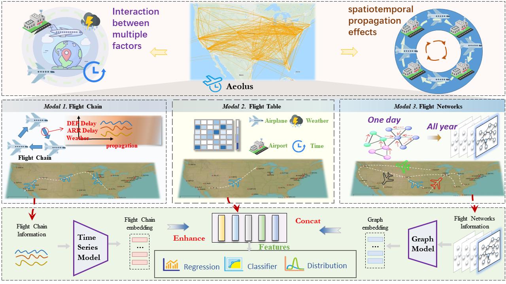
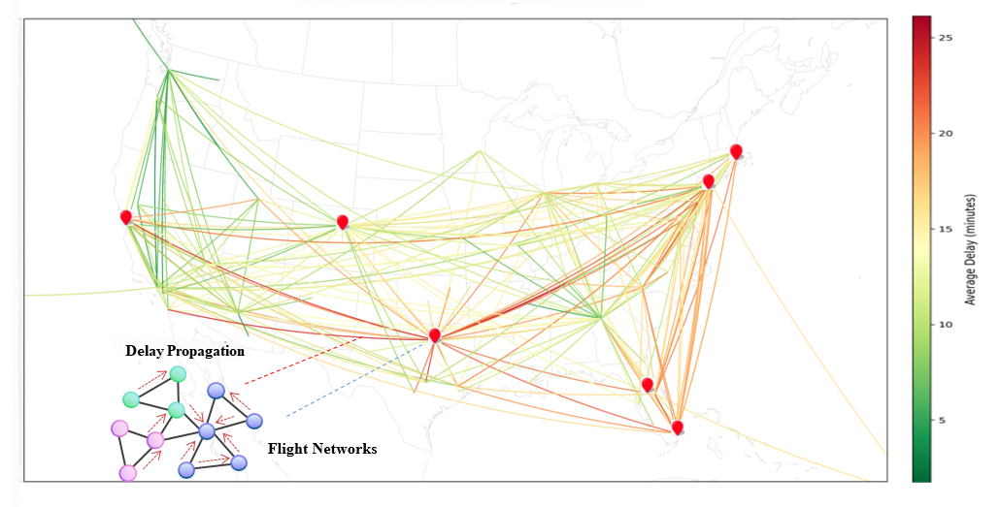
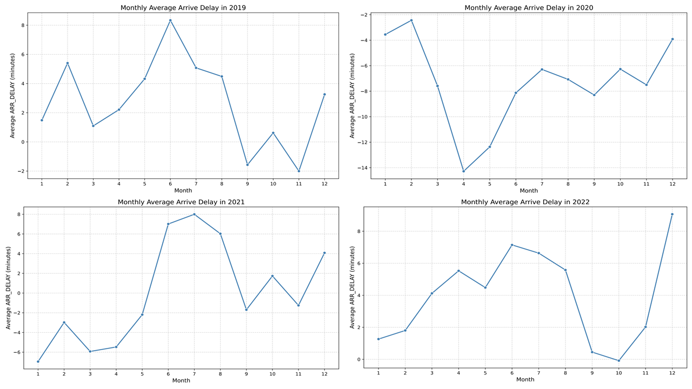

# Aeolus：A Multi-structural Flight Delay Dataset

- This repository provides the full experimental pipeline for building benchmark datasets from the “Aeolus: A Multi‑structural Flight Delay Dataset” (available on Kaggle: [mfdd‑multi‑modal‑flight‑delay‑dataset](https://www.kaggle.com/datasets/flnny123/mfddmulti-modal-flight-delay-dataset)). It demonstrates how to construct the tabular and graph-based datasets from Aeolus, run multimodal baselines, and visualize delay patterns. You can reproduce experiments across modalities and methodologies, and explore visualizations that help analyze and understand flight delay dynamics.
---

## 📂 Repository Structure
- `Datasets/`: Data extraction, tabular and graph constructors.
- `exp/`: Experimental scripts for chain, network, and tabular baselines.
- `util/`: Utility modules for validation and figure generation.

---

## 📊 Dataset Schema & Features

| Feature Name        | Description                                       | Example     |
|---------------------|---------------------------------------------------|-------------|
| `FL_DATE`           | Flight date/time                                   | `2024/01/01 00:00` |
| `OP_CARRIER`        | Operating airline code                            | `9E`        |
| `OP_CARRIER_FL_NUM` | Flight number                                      | `4814`      |
| `ORIGIN` / `DEST`   | Origin and destination airport IATA code          | `JFK` / `DTW` |
| `CRS_DEP_TIME`      | Scheduled departure time                           | `12:52`     |
| `DEP_TIME`, `DEP_DELAY` | Actual departure time and delay in minutes    | `12:47`, `-5` |
| `ARR_TIME`, `ARR_DELAY` | Actual arrival time and delay                  | `14:49`, `-19`|
| `TAXI_OUT`, `TAXI_IN` | Taxi-out and taxi-in durations                 | `31`, `7`    |
| `CRS_ELAPSED_TIME`, `ACTUAL_ELAPSED_TIME`, `AIR_TIME` | Flight durations | `136`, `122`, `84` |
| `MONTH`, `DAY_OF_MONTH`, `DAY_OF_WEEK` | Calendar features              | `1`, `1`, `1` |
| `ORIGIN_INDEX`, `DEST_INDEX` | Airport index for embedding lookup       | `166`, `93` |
| `O_TEMP`, `O_PRCP`, `O_WSPD` | Origin weather: temperature, precipitation, wind speed | `4.4°C`, `0 in`, `11.2 mph` |
| `D_TEMP`, `D_PRCP`, `D_WSPD` | Destination weather                          | `0°C`, `0 in`, `13 mph` |
| `O_LATITUDE`, `O_LONGITUDE`, `D_LATITUDE`, `D_LONGITUDE` | Geographic coordinates | `40.63975`, `-73.77893` |

---

## 🎯 Key Capabilities

- Tabular data construction for ARR_DELAY and DEP_DELAY tasks  
- Flight-chain modeling (aircraft & crew continuity)  
- Flight-graph construction (airport/airspace resource interactions)  
- Support baseline models: MLP, AutoInt, TabulaRNN, ResNet, VGAE+AFM， etc.

---

## 🔬 Experiments & Visualization

- **Tabular baseline experiments** under `exp/Tab_exp`  
- **Time-based modeling pipelines** under `exp/Chain_exp`
- **Graph-based modeling pipelines** under `exp/Network_exp`
- Some visualizations are shown below. For more visualizations, see `util/figures`

### SHAP Summary Plot
- The SHAP summary beeswarm plot illustrates how the top‑15 features influence model predictions—each point shows an instance’s feature value and its positive or negative contribution (SHAP value) to delay prediction, with color encoding feature magnitude and horizontal position indicating impact on output

### Delay propagation visualization in Flight Chains
- The delay propagation visualization plots a flight chain across hub airports—with color‑coded lines showing average arrival delays—highlighting how an upstream delay travels through connections to downstream locations.

### Delay propagation visualization in Flight Networks
- The delay propagation visualization highlights how average arrival delays flow through connected airports in the flight network—edges colored by delay indicate how upstream disruptions spread across routes in the airport graph.

### Monthly Average Arrival Delay Trends (2019-2022) with COVID-19 Impact
- This graph illustrates the monthly average arrival delay for the years 2019 to 2022, highlighting the atypical delay patterns during the COVID-19 pandemic, particularly between March and June 2020, when flight disruptions caused an abnormal trend in the data.

---

## 🚧 Limitations & Future Work

- Lacking fine-grained operational signals such as real‑time ATC interventions, crew rotation, or passenger itineraries  
- Strong geographic bias: ~78% of flights originate in North America; limited coverage for regional hubs in Africa or South Asia  
- Large scale and multimodal nature may impose high computational requirements; reproducibility supported via full configuration scripts, with lightweight subsets planned
